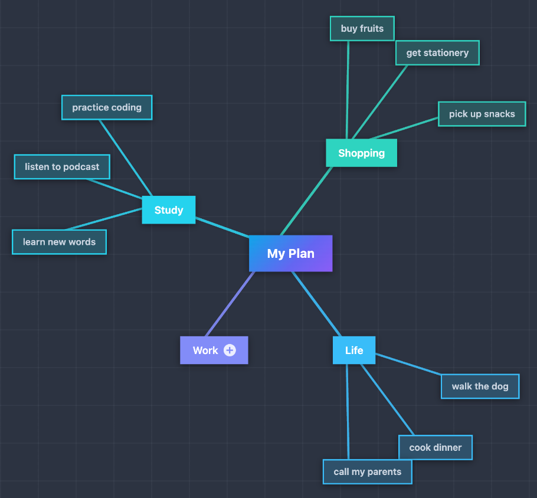

# Light Mindmap

**English** | [简体中文](README.zh-CN.md)

Auto-renders markdown headings as a colorful, interactive mindmap — no extra syntax required.

## Preview




## How It Works

Add `type: mindmap` to any note's frontmatter. The plugin replaces the editor/reading view with a live mind map built from the note's heading hierarchy.

```yaml
---
type: mindmap
---

# My Plan
## Life
### walk the dog
### cook dinner
### call my parents
## *Work*
### write report
### team discussion
### send emails
## *Study*
### learn new words
### listen to podcast
### practice coding
## Shopping
### buy fruits
### get stationery
### pick up snacks

```

The mind map updates in real time as you edit the source.

## Features

### Auto-Render from Headings

- Parses all heading levels (`#` through `######`) into a tree
- Strips inline markdown (bold, italic, links, wikilinks, code) from node labels
- When multiple top-level headings exist, a virtual root node (named after the file) is created automatically
- Fenced code blocks are skipped during parsing

### Layouts

Three layout modes, switchable from the toolbar or via command:

| Layout       | Description                                                                    |
| ------------ | ------------------------------------------------------------------------------ |
| **Balanced** | Children are distributed to both sides of the root, weighted by subtree height |
| **Right**    | All branches expand to the right                                               |
| **Left**     | All branches expand to the left                                                |

### Themes

Seven built-in color palettes:

| Theme        | Style                                         |
| ------------ | --------------------------------------------- |
| **Vibrant**  | Indigo/violet/pink gradient — the default     |
| **Classic**  | Earth tones on a warm cream background        |
| **Fresh**    | Greens and teals on a light mint background   |
| **Ocean**    | Blues and indigos on a pale blue background   |
| **Sunset**   | Reds, oranges, and pinks on a warm background |
| **Midnight** | Neon accents on a dark slate background       |
| **Slate**    | Cool blue-grey with a subtle tech grid pattern |

Themes adapt automatically to Obsidian's dark/light mode.

### Connection Line Styles

| Style                  | Shape                          | Dash   |
| ---------------------- | ------------------------------ | ------ |
| **Smooth**             | Cubic Bézier curve             | Solid  |
| **Smooth Dashed**      | Cubic Bézier curve             | Dashed |
| **Straight**           | Direct line                    | Solid  |
| **Right Angle**        | Horizontal + vertical segments | Solid  |
| **Right Angle Dashed** | Horizontal + vertical segments | Dashed |

### Node Shapes

| Shape          | Appearance                            |
| -------------- | ------------------------------------- |
| **Rounded**    | Rounded rectangle (default)           |
| **Square**     | Sharp corners                         |
| **Borderless** | No border or background on leaf nodes |
| **Pill**       | Fully rounded capsule                 |
| **Doodle**     | Hand-drawn style with slight rotation |

### Pan & Zoom

- **Drag** the canvas background to pan (mouse or touch)
- **Pinch** to zoom on touch devices
- **Scroll** to pan vertically/horizontally
- **Ctrl/Cmd + Scroll** to zoom in/out around the cursor
- Toolbar buttons: **Fit** (fit all nodes into view), **+** / **−** (step zoom)

### Node Editing

Nodes can be edited directly on the canvas — changes are written back to the markdown file:

| Action                        | Gesture / Key                                  |
| ----------------------------- | ---------------------------------------------- |
| Select node                   | Click                                          |
| Edit node text                | Double-click or **F2**                         |
| Confirm edit + add sibling    | **Enter**                                      |
| Confirm edit + add child      | **Tab**                                        |
| Cancel edit                   | **Escape**                                     |
| Add sibling (without editing) | Select node, press **Enter**                   |
| Add child (without editing)   | Select node, press **Tab**                     |
| Delete node                   | Select node, press **Delete** or **Backspace** |
| Collapse / expand node        | Select node, press **Space**                   |

- The root node cannot be deleted.
- Pressing **Enter** on the root node has no effect (no sibling can be added above root).
- Pressing **Tab** on a collapsed node auto-expands it and adds a new child.
- Double-clicking or pressing **F2** on a collapsed node auto-expands it and enters edit mode.
- Collapsed nodes display a **+** badge after the text. The badge is also rendered in exported PNGs.

### Persisted Settings

All per-file display preferences are written to frontmatter and restored on next open:

| Frontmatter key  | Values                                                                 |
| ---------------- | ---------------------------------------------------------------------- |
| `mindmap-layout` | `balanced` / `right` / `left`                                          |
| `mindmap-theme`  | `vibrant` / `classic` / `fresh` / `ocean` / `sunset` / `midnight` / `slate` |
| `mindmap-line`   | `curve` / `straight` / `polyline` / `polyline-dashed` / `curve-dashed` |
| `mindmap-node`   | `rounded` / `square` / `borderless` / `circle` / `doodle`              |

### Toggle Source View

- **Edit Markdown** button in the toolbar hides the mind map and shows a floating **Light Mindmap** button
- Returning from source view auto-fits the mindmap to the viewport
- Command palette: **Toggle mindmap / source view**
- Command palette: **Cycle mindmap layout (balanced / right / left)**

### Export PNG

Click the **Export PNG** button in the toolbar to save the current mindmap as a high-resolution PNG image (2x scale). A system file dialog will let you choose the save location.

## Installation

### From Obsidian Community Plugins (recommended)

1. Open **Settings → Community plugins → Browse**
2. Search for **Light Mindmap**
3. Click **Install**, then **Enable**

### Manual

1. Download `main.js`, `manifest.json`, and `styles.css` from the [latest release](https://github.com/ninglg/obsidian-light-mindmap/releases/latest)
2. Copy the three files into `<vault>/.obsidian/plugins/obsidian-light-mindmap/`
3. Reload Obsidian and enable the plugin in **Settings → Community plugins**

## Example Frontmatter

```yaml
---
type: mindmap
mindmap-layout: balanced
mindmap-theme: vibrant
mindmap-line: curve
mindmap-node: rounded
---
```

## Compatibility

- Minimum Obsidian version: **1.4.0**
- Desktop and mobile supported
- Works with both light and dark Obsidian themes

## License

MIT
