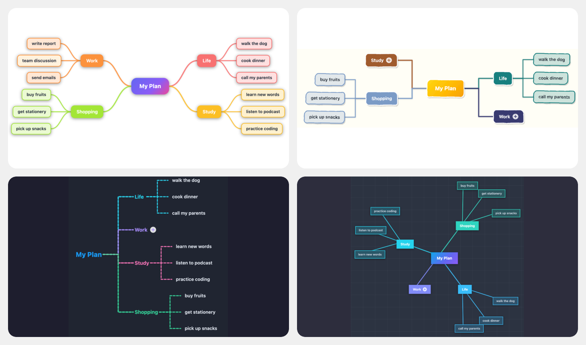

# Light Mindmap

**English** | [简体中文](#License)

Feature-rich mindmap plugin — multiple layouts, themes, node shapes & line styles, wikilink support, node collapse, PNG export — all from plain Markdown headings and nested lists, no custom syntax needed.

**Key feature:** supports mindmaps deeper than six levels and three Markdown structure modes: heading-only, hybrid headings plus lists, and pure nested lists.

## What's New in This Version

- **More than six levels:** deep mindmaps can continue past Markdown's six heading levels.
- **Three structure modes:** choose **Heading**, **Hybrid**, or **List** from the toolbar.
- **Automatic format detection:** converting an existing Markdown note detects heading-only, heading-plus-list, or list-only structure and writes `mindmap-structure`.
- **Editable source compatibility:** canvas edits are written back using the selected Markdown structure mode.
- **Drag and keyboard restructuring:** move nodes by dragging, reorder siblings with `Shift + ArrowUp/ArrowDown`, promote with `Shift + Tab` or `Mod + ArrowLeft`, and demote with `Mod + ArrowRight`.
- **Safer mode switching:** heading mode is blocked for maps deeper than six levels, because Markdown headings cannot represent that depth.

## Preview


## How It Works

Add `type: mindmap` to any note's frontmatter. The plugin replaces the editor/reading view with a live mind map built from the note's Markdown structure. Use the toolbar **Mode** dropdown to choose **Heading**, **Hybrid**, or **List** mode. Hybrid mode stores levels 1-6 as headings and deeper nodes as nested list items.

You can also right-click a folder in the file explorer and select **Create light mindmap** to quickly create a new mindmap file in that folder.

To convert an existing Markdown note, click the ribbon **Convert current note to mindmap** button, run the same command from the command palette, or right-click a Markdown file and choose **Convert to light mindmap**. The command adds the required `type: mindmap` frontmatter and default display settings without rewriting the note body. It also detects whether the note is heading-only, heading plus list, or list-only, then writes the matching `mindmap-structure` value.

```yaml
---
type: mindmap
mindmap-structure: hybrid
---

# My Plan
## Life
### walk the dog
### cook dinner
### call my parents
## *Work*
### write report
### team discussion
### send emails
## *Study*
### learn new words
### listen to podcast
### practice coding
## Shopping
### buy fruits
### get stationery
### pick up snacks
###### detailed checklist
- compare prices
  - local store
  - online store

```

The mind map updates in real time as you edit the source.

## Features

### Auto-Render from Selectable Structure Modes

- Toolbar **Mode** dropdown switches between `heading`, `hybrid`, and `list` structure modes
- `heading` mode parses Markdown headings (`#` through `######`) only
- `hybrid` mode parses headings plus nested list items, so structures can continue beyond six heading levels
- `list` mode parses nested Markdown list items only
- Provides a one-click conversion button/command for existing Markdown notes and auto-detects the structure mode
- Strips inline markdown (bold, italic, links, wikilinks, code) from node labels
- When multiple top-level headings exist, a virtual root node (named after the file) is created automatically
- Fenced code blocks are skipped during parsing

### Structure Modes

| Mode | Source format | Best for |
| ---- | ------------- | -------- |
| **Heading** | Markdown headings only | Short maps that should stay as ordinary document outlines |
| **Hybrid** | Headings for levels 1-6, nested lists for deeper nodes | Deep maps that still need readable document sections |
| **List** | Nested Markdown lists only | Mobile-friendly outlining and fast indentation editing |

The selected mode is saved in frontmatter as `mindmap-structure`. If the key is missing, the plugin scans the note body and chooses `hybrid` for heading plus list documents, `list` for list-only documents, and `heading` for heading-only documents.

### Deep Mindmaps with Lists

Markdown only defines six heading levels. For deeper mindmaps, continue the hierarchy with nested Markdown lists after a heading:

```markdown
# Root
## Branch
### Level 3
#### Level 4
##### Level 5
###### Level 6
- Level 7
  - Level 8
    - Level 9
```

Canvas node edits are still written back to the source note. Levels 1-6 are serialized as headings, and deeper levels are serialized as nested list items.

### Layouts

Five layout modes, switchable from the toolbar dropdown or via command:

| Layout           | Description                                                                    |
| ---------------- | ------------------------------------------------------------------------------ |
| **Balanced**     | Children are distributed to both sides of the root, weighted by subtree height |
| **Right**        | All branches expand to the right                                               |
| **Left**         | All branches expand to the left                                                |
| **Tree**         | Top-down tree — root at the top, branches expand downward                      |
| **Radial**       | Root at the center, branches radiate outward in a circle                       |

### Themes

Seven built-in color palettes:

| Theme        | Style                                         |
| ------------ | --------------------------------------------- |
| **Vibrant**  | Indigo/violet/pink gradient — the default     |
| **Classic**  | Earth tones on a warm cream background        |
| **Fresh**    | Greens and teals on a light mint background   |
| **Ocean**    | Blues and indigos on a pale blue background   |
| **Sunset**   | Reds, oranges, and pinks on a warm background |
| **Midnight** | Neon accents on a dark slate background       |
| **Slate**    | Cool blue-grey with a subtle tech grid pattern |

Themes adapt automatically to Obsidian's dark/light mode.

### Connection Line Styles

| Style                  | Shape                          | Dash   |
| ---------------------- | ------------------------------ | ------ |
| **Smooth**             | Cubic Bézier curve             | Solid  |
| **Smooth Dashed**      | Cubic Bézier curve             | Dashed |
| **Straight**           | Direct line                    | Solid  |
| **Right Angle**        | Horizontal + vertical segments | Solid  |
| **Right Angle Dashed** | Horizontal + vertical segments | Dashed |

### Node Shapes

| Shape          | Appearance                            |
| -------------- | ------------------------------------- |
| **Rounded**    | Rounded rectangle (default)           |
| **Square**     | Sharp corners                         |
| **Borderless** | No border or background on leaf nodes |
| **Pill**       | Fully rounded capsule                 |
| **Doodle**     | Hand-drawn style with slight rotation |

### Pan & Zoom

- **Drag** the canvas background to pan (mouse or touch)
- **Pinch** to zoom on touch devices
- **Scroll** to pan vertically/horizontally
- **Ctrl/Cmd + Scroll** to zoom in/out around the cursor
- Toolbar buttons: **Fit** (fit all nodes into view), **+** / **−** (step zoom)

### Node Editing

Nodes can be edited directly on the canvas — changes are written back to the markdown file:

| Action                        | Gesture / Key                                  |
| ----------------------------- | ---------------------------------------------- |
| Select node                   | Click                                          |
| Edit node text                | Double-click or **F2**                         |
| Confirm edit                  | **Enter**                                      |
| Confirm edit + add child      | **Tab**                                        |
| Cancel edit                   | **Escape**                                     |
| Add sibling (without editing) | Select node, press **Enter**                   |
| Add child (without editing)   | Select node, press **Tab**                     |
| Delete node                   | Select node, press **Delete** or **Backspace** |
| Collapse / expand node        | Select node, press **Space**                   |
| Move sibling up / down        | Select node, press **Shift + ArrowUp / ArrowDown** |
| Promote node                  | Select node, press **Shift + Tab** or **Mod + ArrowLeft** |
| Demote under previous sibling | Select node, press **Mod + ArrowRight**        |
| Drag node                     | Drag onto another node; top/bottom drops reorder, middle drops as child |
| Right-click context menu      | Right-click on node                            |

- The root node cannot be deleted.
- Pressing **Enter** on the root node has no effect (no sibling can be added above root).
- Pressing **Tab** on a collapsed node auto-expands it and adds a new child.
- Double-clicking or pressing **F2** on a collapsed node auto-expands it and enters edit mode.
- Collapsed nodes display a **+** badge after the text. The badge is also rendered in exported PNGs.

### Right-Click Context Menu

Right-click on any node to open the context menu with quick actions:

| Action           | Description                                                 |
| ---------------- | ----------------------------------------------------------- |
| **Edit**         | Enter edit mode for the node                                |
| **Add Sibling**  | Insert a sibling node (not available on root)               |
| **Add Child**    | Create a child node (auto-expands if collapsed)             |
| **Collapse**     | Toggle collapsed state (only for nodes with children)       |
| **Delete**       | Delete the node (not available on root)                     |

The context menu automatically displays in Chinese or English based on Obsidian's language setting.

### Persisted Settings

All per-file display preferences are written to frontmatter and restored on next open:

| Frontmatter key  | Values                                                                 |
| ---------------- | ---------------------------------------------------------------------- |
| `mindmap-structure` | `heading` / `hybrid` / `list`                                      |
| `mindmap-layout` | `balanced` / `right` / `left` / `tree` / `radial`                      |
| `mindmap-theme`  | `vibrant` / `classic` / `fresh` / `ocean` / `sunset` / `midnight` / `slate` |
| `mindmap-line`   | `curve` / `straight` / `polyline` / `polyline-dashed` / `curve-dashed` |
| `mindmap-node`   | `rounded` / `square` / `borderless` / `circle` / `doodle`              |

### Toggle Source View

- **Edit Markdown** button in the toolbar hides the mind map and shows a floating **Light Mindmap** button
- Returning from source view auto-fits the mindmap to the viewport
- Command palette: **Toggle mindmap / source view**
- Command palette: **Cycle mindmap layout (balanced / right / left / tree / radial)**

### Links & Wiki-links

Markdown links (`[text](url)`) and wiki-links (`[[Note]]`, `[[Note|Alias]]`) in heading or list-item text are rendered as clickable links on the mindmap canvas.

- **External links** (`http://...`) open in the default browser
- **Internal links** (relative paths like `./note.md`) open in a new Obsidian tab
- **Wiki-links** (`[[Note]]`) open the target note in a new Obsidian tab — supports shortest paths, relative paths, and aliases natively

During node editing, typing `[[` triggers an autocomplete popup that searches all vault notes. Use **↑↓** to navigate, **Enter** to insert, **Escape** to dismiss. Links are shown as plain text while editing for easy modification.

### Export PNG

Click the **Export PNG** button in the toolbar to save the current mindmap as a high-resolution PNG image (2x scale). A system file dialog will let you choose the save location.

## Installation

### From Obsidian Community Plugins (recommended)

1. Open **Settings → Community plugins → Browse**
2. Search for **Light Mindmap**
3. Click **Install**, then **Enable**

### Manual

1. Download `main.js`, `manifest.json`, and `styles.css` from the [latest release](https://github.com/ninglg/obsidian-light-mindmap/releases/latest)
2. Copy the three files into `<vault>/.obsidian/plugins/obsidian-light-mindmap/`
3. Reload Obsidian and enable the plugin in **Settings → Community plugins**

## Example Frontmatter

```yaml
---
type: mindmap
mindmap-structure: hybrid
mindmap-layout: balanced
mindmap-theme: vibrant
mindmap-line: curve
mindmap-node: rounded
---
```

## Compatibility

- Minimum Obsidian version: **1.4.0**
- Desktop and mobile supported
- Works with both light and dark Obsidian themes

## License

MIT

---

[English](#light-mindmap) | **简体中文**

功能丰富的思维导图插件——多种布局、主题、节点形状与连线样式，支持双向链接、节点折叠、PNG 导出——基于 Markdown 标题和嵌套列表渲染，无需任何自定义语法。

**主要特点：**支持超过 6 层的导图节点，并同时支持三种 Markdown 结构模式：纯标题、标题加列表、纯列表。

## 本版本新增

- **超过 6 层节点：**导图可以突破 Markdown 六级标题限制继续向下展开。
- **三种结构模式：**工具栏可直接选择 **Heading**、**Hybrid**、**List**。
- **自动识别格式：**把已有 Markdown 转为导图时，会自动识别纯标题、标题加列表、纯列表，并写入 `mindmap-structure`。
- **源文档可编辑同步：**在画布上编辑节点后，会按当前结构模式写回 Markdown。
- **拖拽和快捷键调整结构：**可拖拽节点改变位置和父级；`Shift + ArrowUp/ArrowDown` 调整同级顺序，`Shift + Tab` 或 `Mod + ArrowLeft` 提升一级，`Mod + ArrowRight` 降到上一个同级节点下面。
- **更安全的模式切换：**超过 6 层的导图不会被切到纯标题模式，避免 Markdown 表达不了深层结构。

## 预览


## 使用方法

在笔记的 frontmatter 中添加 `type: mindmap`，插件会自动将编辑/阅读视图替换为实时思维导图，导图内容来自笔记的 Markdown 结构。可以在工具栏 **Mode** 下拉框中选择 **Heading**、**Hybrid** 或 **List** 模式；混合模式会把 1-6 层保存为标题，更深层节点保存为嵌套列表。

也可以在文件资源管理器中右键点击**文件夹**，选择 **新建轻量级脑图**，快速在该文件夹下创建一个新的脑图文件。

如果要转换已有 Markdown 笔记，可以点击左侧 ribbon 的 **Convert current note to mindmap** 按钮、从命令面板运行同名命令，或右键 Markdown 文件选择 **Convert to light mindmap**。该命令只会补上所需的 `type: mindmap` frontmatter 和默认显示设置，不会重写正文内容。它会自动识别笔记是纯标题、标题加列表，还是纯列表，并写入对应的 `mindmap-structure`。

```yaml
---
type: mindmap
mindmap-structure: hybrid
---

# My Plan
## Life
### walk the dog
### cook dinner
### call my parents
## *Work*
### write report
### team discussion
### send emails
## *Study*
### learn new words
### listen to podcast
### practice coding
## Shopping
### buy fruits
### get stationery
### pick up snacks

```

编辑源文件时，思维导图会实时更新。

## 功能特性

### 从可选结构模式自动生成导图

- 工具栏 **Mode** 下拉框可在 `heading`、`hybrid`、`list` 三种结构模式间切换
- `heading` 模式只解析 Markdown 标题（`#` 到 `######`）
- `hybrid` 模式解析标题和嵌套列表，使导图可以继续超过六层
- `list` 模式只解析嵌套 Markdown 列表
- 为已有 Markdown 笔记提供一键转换按钮/命令，并自动识别结构模式
- 自动去除节点文本中的行内 Markdown 格式（粗体、斜体、链接、Wiki 链接、行内代码）
- 当存在多个顶级标题时，会自动创建以文件名命名的虚拟根节点
- 解析时自动跳过围栏代码块

### 结构模式

| 模式 | 源格式 | 适合场景 |
| ---- | ------ | -------- |
| **Heading** | 只使用 Markdown 标题 | 层级较短、希望保留普通文档大纲的导图 |
| **Hybrid** | 1-6 层标题，更深层使用嵌套列表 | 深层导图，同时保留可读章节结构 |
| **List** | 只使用嵌套 Markdown 列表 | 手机端快速缩进编辑、移动端友好的大纲 |

选择结果会保存到 frontmatter 的 `mindmap-structure`。如果缺少该字段，插件会扫描正文：标题加列表识别为 `hybrid`，纯列表识别为 `list`，纯标题识别为 `heading`。

### 使用列表表达深层导图

Markdown 只定义了六级标题。对于更深的导图，可以在标题后继续使用嵌套列表：

```markdown
# Root
## Branch
### Level 3
#### Level 4
##### Level 5
###### Level 6
- Level 7
  - Level 8
    - Level 9
```

画布上的节点编辑仍会写回源笔记。第 1-6 层会保存为标题，更深层级会保存为嵌套列表项。

### 布局模式

五种布局，可通过工具栏下拉菜单或命令切换：

| 布局       | 说明                                           |
| ---------- | ---------------------------------------------- |
| **均衡**   | 子节点分布于根节点两侧，按子树高度加权分配     |
| **向右**   | 所有分支向右展开                               |
| **向左**   | 所有分支向左展开                               |
| **树形**   | 自上而下树状布局，根节点在顶部，分支向下展开   |
| **放射**   | 根节点居中，分支沿圆周向外辐射                 |

### 主题

七套内置配色方案：

| 主题       | 风格                                       |
| ---------- | ------------------------------------------ |
| **活力**   | 靛蓝/紫罗兰/粉红渐变——默认主题            |
| **经典**   | 暖色大地色调，奶油色背景                   |
| **清新**   | 绿色与青色，薄荷色背景                     |
| **海洋**   | 蓝色与靛色，浅蓝色背景                     |
| **日落**   | 红、橙、粉暖色调，温暖背景                 |
| **午夜**   | 深色底板搭配霓虹色彩                       |
| **石板**   | 冷灰蓝色调，带淡雅科技网格纹理             |

主题会自动适配 Obsidian 的深色/浅色模式。

### 连线样式

| 样式               | 形状               | 虚线 |
| ------------------ | ------------------ | ---- |
| **平滑**           | 三阶贝塞尔曲线     | 实线 |
| **平滑虚线**       | 三阶贝塞尔曲线     | 虚线 |
| **直线**           | 直线段             | 实线 |
| **直角**           | 水平 + 垂直折线    | 实线 |
| **直角虚线**       | 水平 + 垂直折线    | 虚线 |

### 节点形状

| 形状       | 外观                         |
| ---------- | ---------------------------- |
| **圆角**   | 圆角矩形（默认）             |
| **方角**   | 直角矩形                     |
| **无边框** | 叶子节点无边框和背景         |
| **胶囊**   | 完全圆角的胶囊形             |
| **涂鸦**   | 手绘风格，带轻微随机旋转     |

### 平移与缩放

- **拖拽** 画布背景进行平移（支持鼠标和触屏）
- **捏合** 进行触屏缩放
- **滚轮** 上下/左右平移
- **Ctrl/Cmd + 滚轮** 以光标为中心缩放
- 工具栏按钮：**适配**（将所有节点适配到视窗）、**+** / **−**（步进缩放）

### 节点编辑

可直接在画布上编辑节点，修改会回写到 Markdown 源文件：

| 操作                       | 手势 / 按键                             |
| -------------------------- | --------------------------------------- |
| 选中节点                   | 单击                                    |
| 编辑节点文字               | 双击或按 **F2**                         |
| 确认编辑                   | **Enter**                               |
| 确认编辑并添加子节点       | **Tab**                                 |
| 取消编辑                   | **Escape**                              |
| 添加同级节点（无需编辑）   | 选中节点后按 **Enter**                  |
| 添加子节点（无需编辑）     | 选中节点后按 **Tab**                    |
| 删除节点                   | 选中节点后按 **Delete** 或 **Backspace**|
| 折叠/展开节点              | 选中节点后按 **Space**                  |
| 上下移动同级节点           | 选中节点后按 **Shift + ArrowUp / ArrowDown** |
| 提升节点层级               | 选中节点后按 **Shift + Tab** 或 **Mod + ArrowLeft** |
| 降到上一个同级节点下面     | 选中节点后按 **Mod + ArrowRight**       |
| 拖拽节点                   | 拖到目标节点上；上/下边缘表示前后排序，中间表示作为子节点 |
| 右键上下文菜单             | 右键点击节点                            |

- 根节点不可删除。
- 在根节点上按 **Enter** 无效（根节点上方无法添加同级节点）。
- 在已折叠节点上按 **Tab** 会自动展开并添加子节点。
- 双击或按 **F2** 已折叠节点会自动展开并进入编辑模式。
- 已折叠节点的文字后会显示 **+** 标记，导出 PNG 时也会保留该标记。

### 右键上下文菜单

右键点击任意节点可打开上下文菜单，提供快捷操作：

| 操作             | 说明                                                    |
| ---------------- | ------------------------------------------------------- |
| **编辑**         | 进入节点编辑模式                                        |
| **创建同级节点** | 在当前节点同级插入新节点（根节点不可用）                |
| **创建下级节点** | 创建子节点（已折叠时自动展开）                          |
| **折叠/展开**    | 切换折叠状态（仅对有子节点的节点可用）                  |
| **删除**         | 删除节点（根节点不可用）                                |

上下文菜单会根据 Obsidian 的语言设置自动显示中文或英文。

### 持久化设置

所有单文件显示偏好会写入 frontmatter，下次打开时自动恢复：

| Frontmatter 字段   | 可选值                                                                     |
| ------------------ | -------------------------------------------------------------------------- |
| `mindmap-structure`| `heading` / `hybrid` / `list`                                                |
| `mindmap-layout`   | `balanced` / `right` / `left` / `tree` / `radial`                          |
| `mindmap-theme`    | `vibrant` / `classic` / `fresh` / `ocean` / `sunset` / `midnight` / `slate`|
| `mindmap-line`     | `curve` / `straight` / `polyline` / `polyline-dashed` / `curve-dashed`     |
| `mindmap-node`     | `rounded` / `square` / `borderless` / `circle` / `doodle`                  |

### 切换源码视图

- 工具栏中的 **Edit Markdown** 按钮可隐藏思维导图并显示浮动的 **Light Mindmap** 按钮
- 从源码视图返回时会自动适配导图到视窗
- 命令面板：**Toggle mindmap / source view**
- 命令面板：**Cycle mindmap layout (balanced / right / left / tree / radial)**

### 链接与双向链接

标题或列表项中的 Markdown 链接（`[文本](url)`）和 Wiki 链接（`[[笔记]]`、`[[笔记|别名]]`）会直接在思维导图画布上渲染为可点击的链接。

- **外部链接**（`http://...`）在默认浏览器中打开
- **内部链接**（相对路径如 `./note.md`）在新的 Obsidian 标签页中打开
- **Wiki 链接**（`[[笔记]]`）在新的 Obsidian 标签页中打开目标笔记——原生支持最短路径、相对路径和别名

编辑节点时，输入 `[[` 会触发自动补全弹窗，搜索所有 vault 笔记。使用 **↑↓** 导航、**Enter** 插入、**Escape** 关闭。编辑模式下链接显示为纯文本以便修改。

### 导出 PNG

点击工具栏中的 **Export PNG** 按钮，将当前思维导图保存为高清 PNG 图片（2 倍分辨率）。系统文件对话框允许你选择保存位置。

## 安装

### 通过 Obsidian 社区插件安装（推荐）

1. 打开 **设置 → 社区插件 → 浏览**
2. 搜索 **Light Mindmap**
3. 点击 **安装**，然后 **启用**

### 手动安装

1. 从 [最新版本](https://github.com/ninglg/obsidian-light-mindmap/releases/latest) 下载 `main.js`、`manifest.json` 和 `styles.css`
2. 将这三个文件复制到 `<vault>/.obsidian/plugins/obsidian-light-mindmap/` 目录下
3. 重新加载 Obsidian，在 **设置 → 社区插件** 中启用该插件

## Frontmatter 示例

```yaml
---
type: mindmap
mindmap-structure: hybrid
mindmap-layout: balanced
mindmap-theme: vibrant
mindmap-line: curve
mindmap-node: rounded
---
```

## 兼容性

- 最低 Obsidian 版本：**1.4.0**
- 支持桌面端和移动端
- 兼容 Obsidian 深色和浅色主题

## 许可证

MIT
